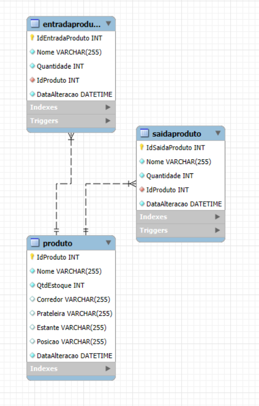

# Controle de Estoque
### Deixei o código para criar a tabela do MySQL em CodigoSQL.sql

### Para funcionar o banco de dados, tem que colocar suas informações do MySQL dentro da classe ConexaoDB em 'InventoryControl/InventoryControl/Persistencia/ConexaoDB.cs'

## 
### Diagrama

